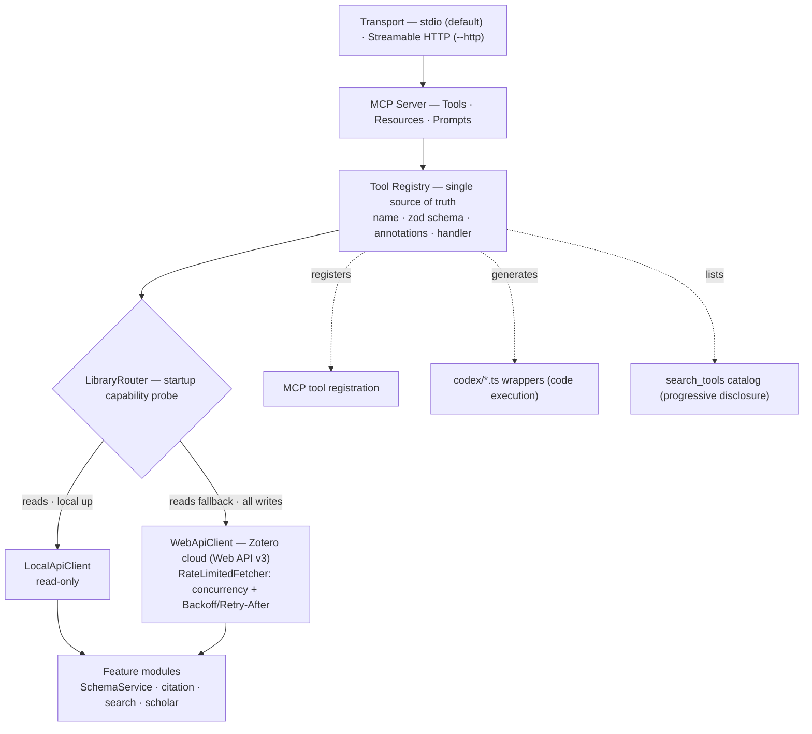
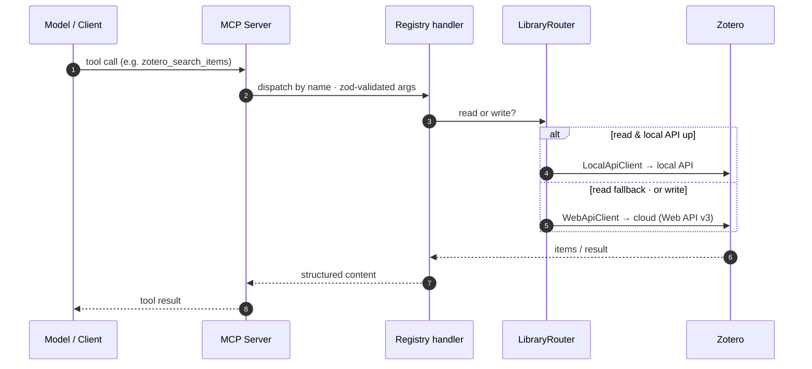

Zoteus is a single TypeScript (Node 20+, ESM) package with clean internal layers.

## Source map

| Path | Responsibility |
|---|---|
| `src/index.ts` | CLI entry: parse flags/env, build server, pick transport |
| `src/server.ts` | `buildServer()` — wires clients, router, features, registers everything |
| `src/config.ts` | env → typed, zod-validated `ZoteusConfig` |
| `src/api/` | `http.ts` (rate-limited fetch), `web-client.ts` (cloud v3), `local-client.ts`, `attachments.ts`, `errors.ts` |
| `src/router/` | `capabilities.ts` (probe), `library-router.ts` (local-vs-cloud reads) |
| `src/schema/` | `schema-service.ts` (cache), `validate.ts` (pre-write validation) |
| `src/registry/` | `ToolDefinition`/`ToolContext` + `registerAllTools` adapter |
| `src/tools/` | one file per tool (24 total) |
| `src/resources/` | `zotero://` resources |
| `src/prompts/` | 7 workflow prompts |
| `src/features/citation` | translation-server client, CSL style resolver, citeproc engine |
| `src/features/search` | tokenizer, BM25, vector store, embeddings, chunker, index manager |
| `src/features/scholar` | OpenAlex + Crossref clients, scholar graph |
| `src/codex/` | generates the code-execution wrapper tree from the registry |
| `src/transports/` | `stdio.ts`, `http.ts` |

## Request lifecycle

How a single tool call flows through the layers — and where the local-vs-cloud routing decision is made:

## Key principles

- **One client owns the hard parts** (versioning, retries, batching) so tools and the model never reason about them.
- **Safe by default** — trash over delete; permanent delete double-gated.
- **Graceful degradation** — local API, translation-server, local embeddings, and scholarly providers are all optional; absence yields a clear message, never a crash.
- **Single registry** drives tools, code-execution wrappers, and discovery so they never drift.
